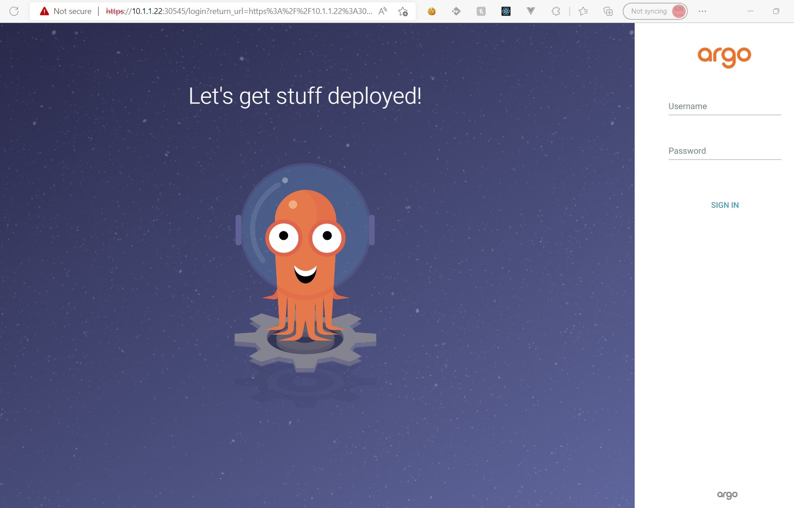

# ArgoCD

## Documentation

All documentation related to ArgoCD can be found under [argo-cd.readthedocs.io](https://argo-cd.readthedocs.io/en/stable/)

---

## Installation

All installation setup is done under the master node

Integrate ArgoCD under a defined namespace and install the configuration

```sh
kubectl create namespace argocd
kubectl apply -n argocd -f https://raw.githubusercontent.com/argoproj/argo-cd/stable/manifests/install.yaml
```

watch the setup completing and make sure everything is fine

```sh
watch kubectl get all -n argocd
```

To have direct access to the web interface offered by ArgoCD we will modify the argocd-server service into a **NodePort**

```
kubectl edit svc argocd-server -n argocd
```

Press <kbd>i</kbd> to start insert

spec.type = ClusterIP &rarr; NodePort

Save with the classic <kbd>:</kbd> + <kbd>w</kbd> + <kbd>q</kbd> (since we are in vim)

Describe the edited service and find the exposed port

```sh
kubectl describe svc argocd-repo-server -n argocd
```

Open the ArgoCD app on the browser via: `http://$(worker-ip):$(port)`



---

## Login

ArgoCD will generate a default secure password that you will be forced to output

```sh
kubectl -n argocd get secret argocd-initial-admin-secret -o jsonpath="{.data.password}" | base64 -d; echo
```

login within the webpage with the credentials:

```
username: admin
password: $(output of previous command)
```

**PLEASE CHANGE YOUR PASSWORD**


---

# With a configured ingress controller

## Setup with ingress controller

As you might have seen, ArgoCD is configured with a **NodePort** service after being configured, we don't necessarly want to expose a weird port and we would want to support ssl. This is why we will move the current **NodePort** into a **ClusterIP**.
