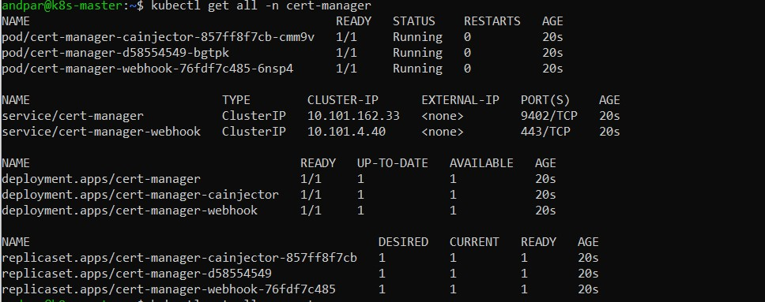

# Cert-Manager

## Documentation

You can find everything related to cert-manager under [cert-manager.io](https://cert-manager.io/docs/)

It is a tool that will handle our ssl certificates for the entire cluster!

## Installation

Install the cert-manager using the `kubectl apply -f` command

```sh
kubectl apply -f https://github.com/cert-manager/cert-manager/releases/download/v1.9.1/cert-manager.yaml
```

All of our resources will be installed under the **cert-manager** namespace.

```sh
kubectl get all -n cert-manager
```



## Configuration

TODO
