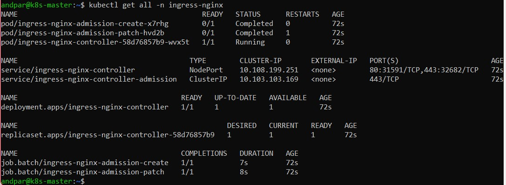

# Nginx ingress controller

## Documentation

For this installation, we will be using the kubernetes community nginx ingress controller.

The ingress controller will be responsible for directing traffic to the correct service, on the correct port. It will allow us to abstract services to being accessible via sub-domains.

All documentation for this project can be found under [kubernetes.github.io/ingress-nginx/](https://kubernetes.github.io/ingress-nginx/deploy/#bare-metal-clusters)

## Installation

Install the ingress controller using the `kubectl apply -f` command

```sh
kubectl apply -f https://raw.githubusercontent.com/kubernetes/ingress-nginx/controller-v1.4.0/deploy/static/provider/baremetal/deploy.yaml
```

All of our resources will be installed under the **ingress-nginx** namespace.

```sh
kubectl get all -n ingress-nginx
```



It is important to note that there is only one replicaset of the ingress controller, meaning there is only one point of entry for the entire infrastructure. This is a scenario in which binding the service direcly to port 80 and 443 of the host machine is beneficial.

We can perform these modifications manually on the deployment using the edit command:

```sh
kubectl edit deployment ingress-nginx-controller -n ingress-nginx
spec.template.spec.hostNetwork: true
```

Alternatively, we can patch the config after applying it:

```sh
kubectl patch deployment ingress-nginx-controller -n ingress-nginx --patch '{"spec": {"template": {"spec":{"dnsPolicy": "ClusterFirstWithHostNet", "hostNetwork": true}}}}'
```

## Routing configuration

TODO
